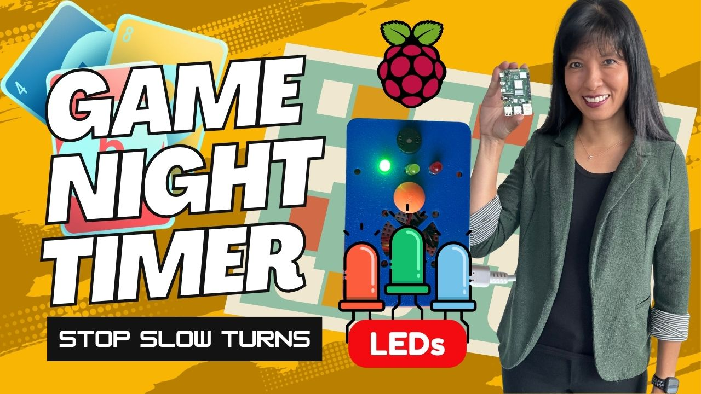

# Raspberry Pi Game Night Timer

DIY, one-button, chess-clock-style timer for board & card games. Press the button, your turn ends, the next player’s countdown starts.

[Watch Episode 1 — LEDs + Button + Buzzer](https://youtu.be/0G3-ISume2o)

[Watch Episode 2 — LCD Screen](https://youtu.be/WSQV_xoQzLM)

[Watch Episode 3 — Bluetooth Speaker + Custom Audio](https://youtu.be/rIc2U7KOW9k)

[](https://youtu.be/0G3-ISume2o)

---

## Wiring (default pins)


| Part            | Pi GPIO | Physical Pin | Notes                                 |
|-----------------|--------:|--------------|----------------------------------------|
| Green LED       |   23    | 16           | 330 Ω series resistor to 5 mm/3 mm LED |
| Yellow LED      |   24    | 18           | 330 Ω series resistor                  |
| Red LED         |   25    | 22           | 330 Ω series resistor                  |
| Button (to GND) |   17    | 11           | Uses internal pull-up in code          |
| Buzzer          |   18    | 12           | Piezo + resistor to GND (PWM capable)  |
| LCD SDA         |    2    | 3            | 16×2 I²C LCD (PCF8574 backpack)        |
| LCD SCL         |    3    | 5            |                                        |
| LCD Vcc         |   5 V   | 2/4          |                                        |
| LCD GND         |   GND   | 6/9/14/etc   |                                        |


---

## Quick start

1. **GitClone**
   ```bash
   sudo apt update && sudo apt upgrade
   git clone https://github.com/carolinedunn/game-night-buzzer.git

3. **Enable I²C**  
   `sudo raspi-config` → *Interface Options* → **I2C** → Enable → Reboot.

4. **Optional: Install Audacity (record yourself)**
   <br>Plug in a USB microphone.
   ```bash
   sudo apt install audacity
